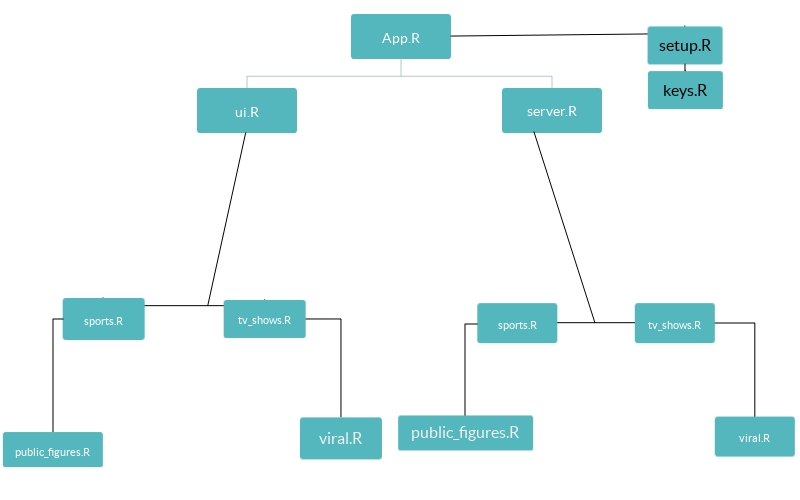

# final-purple-pupples
Purple Puppies' repository for our final project. 

## Structure
The app.R is where our project is entered and then breaksdown into 
ui.R and server.R each respectively housing the shiny ui object and shiny server
object. 

### UI: 
The ui.R pulls all of its sidebarLayout objects from our layout_files organized such that
one tab correlates to one file in this folder. The reason for this is create atomic structures within
each tab of our overall app. We want to keep the UI as compartmentalized as possible in order to stay away from dependencies.

### Server: 
The server.R pulls all of its information from the server_files folder. Each file here
has all of the functions needed for each respective tab. The only trivial nuance is that there may
be similar functions but they must all be _tagged_ differently due to them all being stored in the 
input or output objects.

### Connecting to Twitter Api:
The twitter api authorization and token access is granted through the __setup.R__ file. This file
must have the library _"twitteR"_ and must source __locally__ a _keys.R_ file. This must be ran every
time a new R session is started and a new twitter connection must be created. (Recommended to stash 
the oauth session in .httr-oauth and then place file in .gitignore)

When running the app we source the setup.R file in app.R so our server functions will be accessing
one connection to to the twitter API and not multiple.

## The file structure for our project is as follows:
